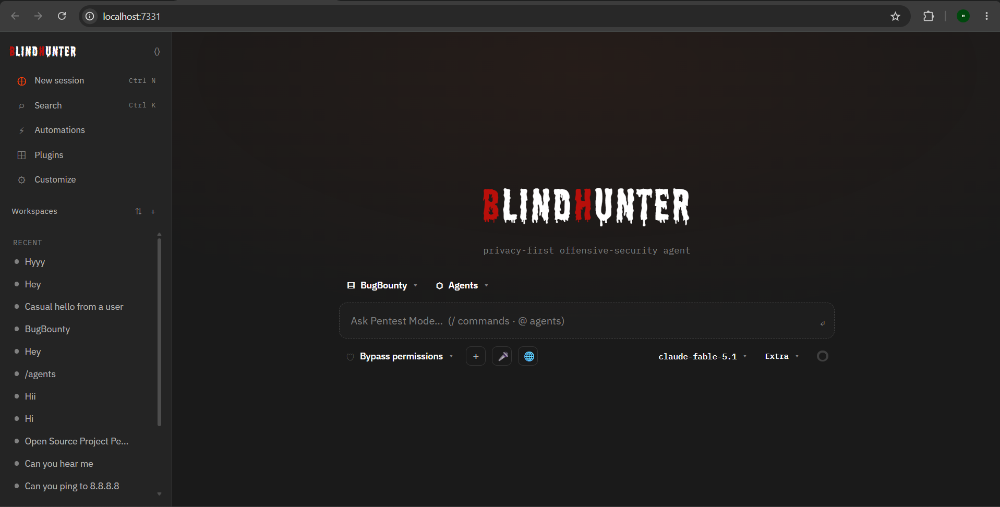

# BlindHunter

**Privacy-first, model-agnostic, open-source AI coding agent for authorized security testing.**

Self-host it, connect any LLM provider — cloud or local — and keep full control of what
leaves your machine. BlindHunter reads and writes files, runs terminal commands, and drives
an engagement from recon to a documented finding.



## Highlights

- **Privacy-first** — runs on your machine, keys stay local, no telemetry, local models are first-class.
- **Model-agnostic** — OpenAI-compatible providers, Anthropic, local (Ollama / LM Studio), and custom endpoints.
- **Agents & subagents** — `@mention` an agent to take over a session; delegate long tool runs to background subagents.
- **Pentest Mode** — a built-in offensive-security operator preset, plus your own custom agents.
- **Self-hosted web UI** — a browser app bound to `127.0.0.1` by default.

## Stack

pnpm monorepo:

- `apps/web` — React + Vite + TypeScript frontend
- `apps/server` — Node + Fastify + TypeScript backend (provider layer, agent loop, tools)
- `packages/*` — shared types and utilities

## Develop

Install dependencies, then start the dev server:

```sh
pnpm install
pnpm dev
```

On Windows PowerShell 5.1, `&&` is not a valid separator — run the two commands on
separate lines (as above), or chain them with:

```powershell
pnpm install; if ($?) { pnpm dev }
```

The web UI runs at http://127.0.0.1:7331.

## Security

BlindHunter runs shell commands. It binds to `127.0.0.1` by default — **do not expose it to a
network without putting your own authentication in front of it.**

## License

MIT © evertrustai
